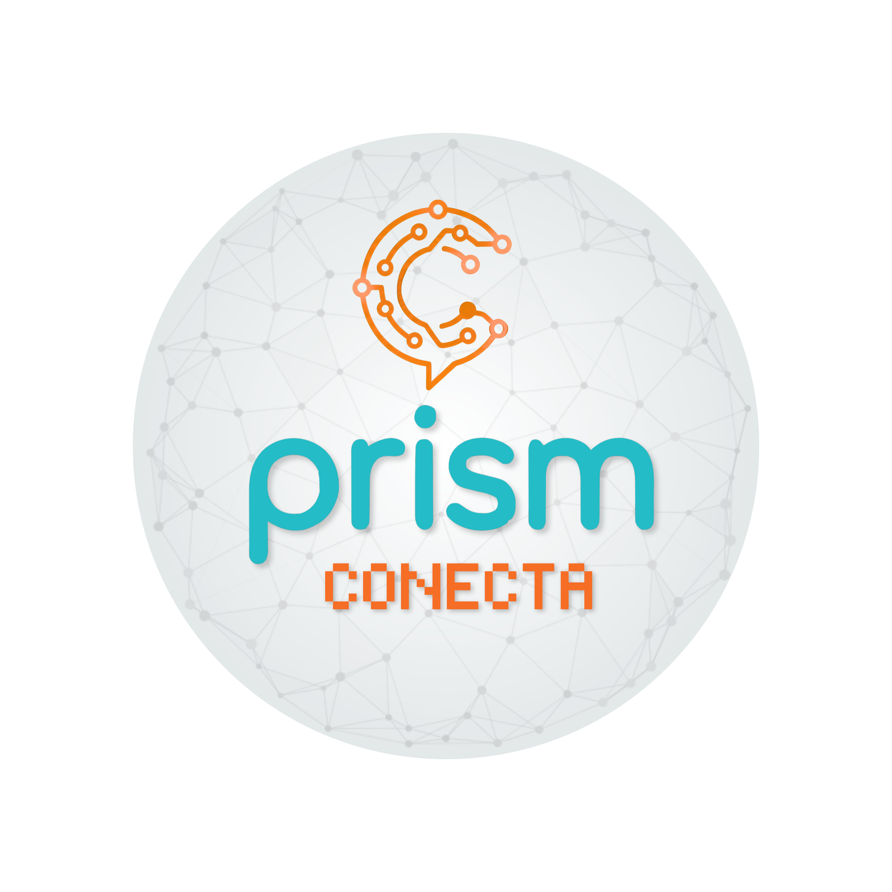

<section id="inicio" class="hero wrap">
  
Boa Vista - RR • Conecta 2026

  

    <h1 class="main-title">O centro de informações do evento PRISM Conecta</h1>
    
  

  

    <article class="card location-card">  
        
Uma jornada de três meses de puro aprendizado e inovação. Promovido pelo <a class="location-title" href="https://prismrr.github.io/">grupo de pesquisa PRISM-RR</a>, o evento oferece um ciclo completo de palestras, minicursos e atividades práticas (hands-on). Mergulhe fundo nas áreas que estão moldando o futuro da tecnologia:

        <ul>
            <li>Sistemas Embarcados Inteligentes</li>
            <li>Sistemas Ciber-Físicos</li>
            <li>Verificação e Testes Automatizados</li>
            <li>Sistemas de Decisão em Engenharia Aplicada</li>
        </ul>

    </article>
  

  
  
Consulte notícias, encontre palestras rapidamente e acesse a inscrição oficial em poucos cliques.

  

    <a href="#agenda" class="btn-primary">Ver agenda</a>
    <a href="https://plataforma-externa.com/inscricao" target="_blank" rel="noopener noreferrer" class="btn-secondary" aria-label="Abrir inscricao oficial em nova aba" data-cta="hero-inscricao">Ir para inscrição</a>
  

</section>

<section id="noticias" class="wrap section">
  

    <h2>Notícias</h2>
    
Comunicados operacionais e atualizações do evento.

  

  

    
    
      <article class="card news-card">
        
{{ item.date | date: "%d/%m/%Y" }}

        <h3>{{ item.title }}</h3>
        
{{ item.excerpt | strip_html | truncate: 140 }}

      </article>
    
  

</section>

<section id="agenda" class="wrap section">
  

    

      <h2>Agenda</h2>
      
Busca textual por horário, trilha, palestrante ou tema.
      
    

    <label class="search-wrap" for="agenda-search">
      Buscar na agenda
      <input id="agenda-search" type="text" placeholder="Buscar na agenda..." autocomplete="off">
    </label>
  

  
Mantenha-se atualizado: nossa agenda é dinâmica.

  
Carregando agenda...

  

    
    
      <article class="card agenda-item" data-search="{{ s.title }} {{ s.speaker }} {{ s.track }} {{ s.date }} {{ s.startTime }} {{ s.room }}">
        
Data: {{ s.date | date: "%d/%m/%Y" }}

        
{{ s.startTime }} - {{ s.endTime }} • {{ s.track }}

        <h3>{{ s.title }}</h3>
        
{{ s.speaker }} • {{ s.room }}

      </article>
    
  

</section>

<section id="localizacao" class="wrap section">
  

    <h2>Localização</h2>
    
Campus Paricarana - UFRR, Laboratório Maloca das iCoisas, Boa Vista - RR.

  

  

    <article class="card location-card">
      
Ponto ofícial do evento

      
Campus Paricarana, Centro de Inovação e Tecnologia. Endereço: Av. Cap. Ene Garcês, 2413 - Aeroporto, Boa Vista - RR.

      
Referência: acesso pela Avenida Capitão Ene Garcez.

      

        <a href="geo:2.8366877066335463, -60.69144884937666?q=UFRR CIT" class="location-link" aria-label="Abrir localizacao no aplicativo de mapas do dispositivo" data-cta="localizacao-geo">Abrir no app de mapas</a>
        <a href="https://maps.google.com/?q=2.8366877066335463, -60.69144884937666" target="_blank" rel="noopener noreferrer" class="location-link secondary" aria-label="Abrir localizacao no Google Maps em nova aba" data-cta="localizacao-webmap">Abrir no navegador</a>
      

      
    </article>

    <article class="card location-card">
      
Plano de contingência de acesso

      <ul class="location-checklist">
        <li>Salve o endereço antes de sair de casa caso a internet fique instavel.</li>
        <li>Use o link geo como primeira opção em dispositivos móveis.</li>
        <li>Se o mapa não abrir, apresente o endereço completo na portaria da UFRR.</li>
      </ul>
    </article>
  

  <article class="card location-map-card" data-cta="localizacao-mapa-cit">
    
Mapa do CIT - Centro de Inovação e Tecnologia

    
Av. Nova Iorque, 48-188 - Aeroporto, Boa Vista - RR, 69310-010.

    

      

        
Ative as funcionalidades de localização no banner de privacidade para ver o mapa interativo.

      

    

    
Se o mapa embutido nao carregar, use os links abaixo.

    

      <a href="geo:0,0?q=Av.+Nova+Iorque,+48-188+-+Aeroporto,+Boa+Vista+-+RR,+69310-010" class="location-link" aria-label="Abrir localizacao do CIT no aplicativo de mapas do dispositivo" data-cta="localizacao-geo-mapa">Abrir no app de mapas</a>
      <a href="https://maps.google.com/?q=Av.+Nova+Iorque,+48-188+-+Aeroporto,+Boa+Vista+-+RR,+69310-010" target="_blank" rel="noopener noreferrer" class="location-link secondary" aria-label="Abrir localizacao do CIT no Google Maps em nova aba" data-cta="localizacao-webmap-mapa">Abrir no navegador</a>
    

  </article>
</section>

<section id="inscricao" class="wrap section">
  

    <h2>Inscrição</h2>
     
  

  <article class="card signup-card">
    
Garanta sua vaga no PRISM Conecta 2026

    
O processo de inscrição ocorre em plataforma externa homologada pela organização do evento.

    

      <a href="https://plataforma-externa.com/inscricao" target="_blank" rel="noopener noreferrer" class="btn-primary" aria-label="Abrir inscricao oficial em nova aba" data-cta="secao-inscricao-principal">Abrir inscrição ofícial</a>
      <!-- <a href="https://plataforma-externa.com/inscricao" target="_blank" rel="noopener noreferrer" class="btn-secondary" aria-label="Abrir link direto de contingencia para inscricao" data-cta="secao-inscricao-contingencia">Usar link direto de contingencia</a> -->
    

    <!-- 
Caso o botao principal nao funcione na sua rede, use o link direto de contingencia acima.
 -->
  </article>
</section>
