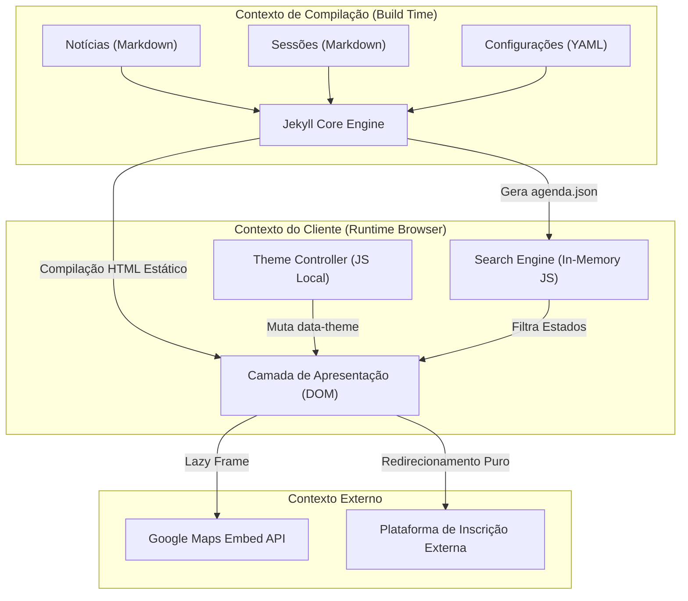
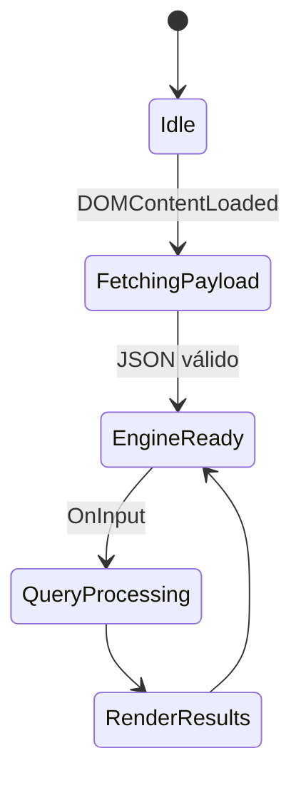

# Product Requirements Document (PRD) Técnico — PRISM Conecta Hub

---

## 1. Fundações e Visão de Produto

### Resumo Executivo & JTBD (Jobs-to-be-Done)

O **PRISM Conecta Hub** é a plataforma de alta performance projetada para centralizar e unificar a experiência informativa do evento Conecta. Sob a perspectiva de engenharia de sistemas, o produto resolve o problema clássico de degradação de acessibilidade e dispersão de informações de agendas tecnológicas em redes móveis restritas (Edge/3G) na região de Roraima.

* **Job-to-be-Done (Core):** "Quando eu estiver participando ou planejando comparecer ao evento Conecta, eu quero acessar instantaneamente a programação atualizada e os comunicados urgentes, mesmo sob conectividade móvel severamente limitada, para que eu possa coordenar minha presença nas trilhas de conteúdo sem fricção ou perda de tempo."
* **Proposta de Valor Técnica:** Arquitetura estática imutável via Jamstack (Jekyll/Tailwind) que elimina processamento dinâmico no servidor (*zero runtime server computing*), movendo a computação para o tempo de compilação (*build time*). O valor gerado se traduz em páginas com peso ultra-reduzido, carregamento instantâneo na borda (Edge) e imunidade a vetores tradicionais de injeção de código e indisponibilidade de banco de dados.

### Hipóteses e Invariantes de Negócio

#### Hipóteses a Validar

1. A disponibilização de uma engine de busca puramente *client-side* operando sobre um payload estático em memória reduz o abandono do portal durante os picos de tráfego do evento.
2. A separação estrita entre o gerenciamento de conteúdo (Markdown) e a infraestrutura de entrega (CDN) reduz o custo operacional e o tempo de publicação de avisos críticos para menos de 5 minutos.

#### Invariantes de Negócio (Regras Invioláveis)

* **INV-001 (Consistência de Agenda):** Nenhuma alteração manual em tempo de execução pode corromper a grade horária exibida. Toda alteração deve derivar de um commit assinado e validado no repositório Git.
* **INV-002 (Acessibilidade de Links Externos):** O redirecionamento para o sistema de inscrição externo deve ser puramente declarativo e não pode depender de cookies, sessões ou execução de scripts de rastreamento de terceiros que possam bloquear o fluxo de conversão.
* **INV-003 (Sustentabilidade Operacional):** O portal em produção não pode conter acoplamento eferente com bancos de dados relacionais ativos ou servidores de aplicação dinâmicos VPS.

### Métricas de Sucesso (North Star)

* **North Star Metric:** *Time-to-Information (TTI)* — O tempo decorrido entre a requisição inicial do usuário (dispositivo móvel) e a exibição legível da próxima palestra filtrada na agenda.
* **Captura Técnica:** Implementada via instrumentação nativa do browser através da API `PerformanceObserver` (OpenTelemetry Web Client). O evento captura as métricas de *Largest Contentful Paint (LCP)* e a latência de execução da busca interna, descarregando os dados de telemetria de forma assíncrona via beacons HTTP sem bloquear a thread principal do navegador.

---

## 2. Escopo Funcional e Comportamental

### Arquitetura de Módulos (Bounded Contexts)



### Matriz de Capacidades

| ID | Requisito Funcional | Ator | Complexidade | Risco | Técnica de Validação |
| --- | --- | --- | --- | --- | --- |
| **CAP-01** | Alternância dinâmica de tema visual (Dark/Light mode). | Usuário Final | S | Baixo | Mutação de `data-theme` no DOM via JavaScript e persistência em `localStorage`. |
| **CAP-02** | Feed de notícias assíncrono baseado em coleções estáticas. | Administrador | M | Baixo | Geração automatizada de blocos HTML estruturados via Jekyll Collections no build. |
| **CAP-03** | Busca e filtragem instantânea de sessões da agenda. | Usuário Final | M | Médio | Filtro *client-side* operando em memória sobre o payload unificado `agenda.json`. |
| **CAP-04** | Exibição de mapa responsivo resiliente a falhas de rede. | Usuário Final | M | Médio | Injeção de `<iframe>` com `loading="lazy"` integrado a fallback de link hipertexto `geo:`. |
| **CAP-05** | Redirecionamento parametrizado para inscrições externas. | Usuário Final | S | Baixo | Links HTML puros sanitizados com atributos `rel="noopener noreferrer"`. |

### Modelagem de Fluxos Críticos (Finite State Machines)

#### FSM-01: Inicialização do Tema Visual e Mitigação de FOUC

* **Estado Inicial:** `Uninitialized`
* **Fluxo:**
* `Uninitialized` -> **Gatilho:** Leitura do `<head>` -> **Condição:** Chave `color-theme` presente no `localStorage` -> **Ação:** Injetar atributo correspondente no elemento raiz `<html>` -> **Estado Final:** `ThemeApplied`
* `Uninitialized` -> **Gatilho:** Leitura do `<head>` -> **Condição:** `localStorage` vazio -> **Ação:** Avaliar `matchMedia(prefers-color-scheme)` e injetar atributo padrão -> **Estado Final:** `ThemeApplied`


#### FSM-02: Ciclo de Vida do Motor de Busca e Tratamento de Exceções



---

## 3. Arquitetura de Dados e Integridade

### Modelo de Dados Conceitual

A persistência de dados em tempo de design é baseada em arquivos planos com tipagem estrita declarada no Front Matter (YAML) de cada entidade.

```
+---------------------------------------------------------------------------------------+
| ENTIDADE: AgendaSession (Coleção Jekyll: _agenda)                                     |
+---------------------------------------------------------------------------------------+
| - id: String (UUIDv4 ou slug determinístico, Primário, Requisito de Imutabilidade)     |
| - title: String (Tamanho máximo: 150 caracteres)                                      |
| - speaker: String                                                                     |
| - track: String (Enum: [Dev, Hardware, IoT, SocialGood])                              |
| - startTime: Time (Formato ISO 8601: HH:MM)                                           |
| - endTime: Time (Formato ISO 8601: HH:MM)                                             |
| - room: String                                                                        |
+---------------------------------------------------------------------------------------+
                                        | (1)
                                        |
                                        | Generates (build time)
                                        |
                                        ▼ (1)
+---------------------------------------------------------------------------------------+
| ARTEFATO DE PRODUÇÃO: agenda.json                                                     |
+---------------------------------------------------------------------------------------+
| - data: Array de Objetos AgendaSession (Imutável em produção)                         |
+---------------------------------------------------------------------------------------+

```

### Estratégia de Persistência & Trade-off Analysis

#### Decisão Arquitetural: Armazenamento Baseado em Sistema de Arquivos (Git-backed Markdown) vs Banco de Dados Relacional (PostgreSQL)

* **Opção A:** Utilizar banco de dados tradicional PostgreSQL exposto via API REST (Express/Node.js).
* **Opção B:** Utilizar arquivos planos Markdown/YAML versionados no Git e compilados pelo Jekyll para gerar artefatos JSON estáticos.
* **Escolha:** **Opção B**.
* **Justificativa:** A infraestrutura universitária local apresenta volatilidade de conectividade e limitações de manutenção de servidores ativos. A Opção B zera a necessidade de gerenciamento de remendos de segurança no banco de dados, elimina custos de servidores ativos (VPS) e garante resiliência total contra ataques de negação de serviço (DDoS) na camada de dados, operando de forma nativa e gratuita em CDNs estáticas.

### Evolução de Schema

Como não existem tabelas relacionais ativas, a evolução de schema (ex: adição de um novo campo como `co-speaker`) é gerenciada exclusivamente através de validações estáticas no pipeline de CI/CD. Esquemas de validação baseados em **JSON Schema** garantem a integridade retroativa. Caso um arquivo antigo não possua o campo novo, o compilador injeta um valor padrão nulo durante a geração do build, prevenindo quebras de renderização no cliente JavaScript (*Zero-Downtime Schema Evolution*).

### Sincronização e Concorrência

O sistema opera sob o paradigma de **Imutabilidade em Produção**. Concorrência de escrita é resolvida nativamente na camada do sistema de controle de versão (Git) através de políticas de branching e travas de Pull Request. Concorrência em tempo de execução no cliente é inexistente, dado que o payload é de leitura exclusiva (*Read-Only*). Idempotência é garantida no build: para um mesmo conjunto de arquivos Markdown de entrada, o compilador Jekyll sempre produzirá exatamente o mesmo conjunto de arquivos HTML/JSON de saída (determinismo estrito).

---

## 4. Requisitos Não Funcionais e Segurança (Baseline)

### Performance & Latency (Service Level Objectives)

* **SLO-001:** Time to First Byte (TTFB) para requisições de páginas e assets estáticos deve ser $\le 150\text{ms}$ quando servido pela CDN.
* **SLO-002:** A execução do filtro de busca no componente `SearchEngine` para um input textual de usuário deve ser concluída em $\le 16\text{ms}$ (garantindo taxa de atualização de quadro de 60fps na UI), operando dentro do teto de processamento linear para o volume de dados estimado do evento.
* **SLO-003:** O Largest Contentful Paint (LCP) em emulação de redes restritas (Fast 3G) deve ser $\le 2.0\text{s}$.

### Segurança por Design

#### Modelo de Ameaças Simplificado (STRIDE)

* **Tampering (Adulteração):** Risco de modificação não autorizada do payload da agenda. *Mitigação:* Bloqueio de escrita em produção; modificações exigem commits assinados digitalmente e aprovação via revisão por pares (*Peer Review*) no repositório GitHub de origem.
* **Information Disclosure (Vazamento de Informações):** Armazenamento acidental de chaves secretas no código aberto. *Mitigação:* Varredura automatizada de strings via TruffleHog impedindo push de segredos.
* **Denial of Service (Negação de Serviço):** Sobrecarga de requisições travando o portal. *Mitigação:* Uso intrínseco de CDNs resilientes globais com mitigação nativa de ataques em camadas 3, 4 e 7.

#### Gestão de Identidade & Controle de Acesso

Delegação total do controle de acesso para o provedor de versionamento (GitHub/GitLab RBAC). Apenas usuários com a role de `Maintainer` possuem permissão para realizar o merge em branches protegidos (`main`), disparando a esteira de deploy automatizada. O cliente final acessa a aplicação de forma anônima, sem armazenamento de PII (Personally Identifiable Information).

#### Criptografia

* **Em Trânsito:** Obrigatoriedade estrita de criptografia TLS 1.3 para todas as conexões, imposta via HSTS (HTTP Strict Transport Security).
* **Em Repouso:** Os artefatos estáticos residem criptografados na infraestrutura de armazenamento físico subjacente do provedor de CDN escolhido.

### Acessibilidade e UX Técnica

* **Baseline de Acessibilidade:** Conformidade obrigatória com os critérios de sucesso da **WCAG 2.1 Nível AA**. Elementos de interface interativos (botões de tema, inputs de busca) devem possuir labels semânticos explícitos (`aria-label`), contraste mínimo de cor de 4.5:1 e suporte integral a navegação por teclado (foco sequencial estruturado via `tabindex`).
* **UX Performance Baseline:** Prevenção de oscilações cumulativas de layout (*Cumulative Layout Shift - CLS* $\le 0.1$) através da declaração explícita das dimensões físicas ou proporções estruturais do contêiner do mapa responsivo (`aspect-ratio: 16/9`).

---

## 5. Estratégia de Desenvolvimento e DX (Developer Experience)

### Ambiente de Desenvolvimento

Para mitigar discrepâncias de versões de dependências runtime ("na minha máquina funciona"), o ambiente de engenharia local é isolado e padronizado por meio de um container Docker fundamentado no ecossistema Ruby minimalista. Qualquer engenheiro inicializa o ambiente idêntico ao de produção executando o manifesto padrão do ecossistema:

```bash
docker-compose up

```

Este comando expõe o servidor de desenvolvimento Jekyll local com recarregamento dinâmico mapeado no volume da estação de trabalho.

### Contratos de Interface

A comunicação entre os componentes estruturais do client-side e a base de dados compilada utiliza o padrão **REST estático** sob o formato de payloads estruturados JSON. O arquivo gerado em tempo de compilação `assets/data/agenda.json` atua como o contrato imutável estável. O versionamento do contrato segue a estrutura de URIs do diretório físico do projeto estático (ex: `/v1/agenda.json`), permitindo evoluções estruturais sem quebrar versões antigas do cliente que possam estar em cache no dispositivo do usuário.

### Testabilidade

O esforço de engenharia de testes segue a abordagem automatizada contínua deslocada para a esquerda (*Shift-Left Testing*):

* **Foco em Integração e Compilação (Build Gates):** Verificação automatizada via scripts Ruby para garantir que o parsing dos metadados de Front Matter das coleções de Markdown não contenha campos ausentes ou tipos de dados inválidos antes de autorizar a compilação final.
* **Foco em Comportamento Client-Side (E2E):** Execução automatizada de testes funcionais no navegador (via Playwright) simulando interações do usuário final com a busca de termos e alternância de temas visuais, assegurando manutenibilidade e isolamento de regressões técnicas.

---

## 6. Roadmap de Entrega e Mitigação

### Definição do MVP (Minimum Viable Product)

O núcleo rígido do produto focado em provar a hipótese de valor e performance compreende:

1. Uma página única responsiva operando sob o Modo Escuro fixo, contendo a descrição institucional e os dados essenciais do evento.
2. Módulo de exibição da Agenda carregada cronologicamente via listagem estática básica, integrada a um input de busca textual simplificado em JavaScript.
3. Seção descritiva de Localização geográfica com endereço textual plano e link de redirecionamento geo-referenciado seguro para o aplicativo de mapas nativo do celular.
4. Call to Action (CTA) limpo e destacado apontando diretamente para o fluxo externo de inscrições.

### Milestones Técnicos

#### Fase 1: Proof of Concept (PoC) — Validação de Riscos

* Homologação da estrutura de compilação de coleções do Jekyll no container Docker.
* Validação de latência e performance de busca client-side rodando sobre payloads de teste de 100 sessões emuladas em navegadores móveis de baixo desempenho.

#### Fase 2: Alpha/Beta — Funcionalidades Críticas & Monitoramento

* Integração da engine de alternância dinâmica de tema visual (Dark/Light) com proteção nativa contra FOUC.
* Implementação do mecanismo de Lazy Loading estrutural e proteção de Fallback para o contêiner do mapa responsivo.
* Configuração inicial do pipeline de CI/CD contendo checagem de segredos e linters estáticos.

#### Fase 3: General Availability (GA) — Escala e Resiliência

* Ativação das regras estritas de cabeçalhos de segurança (CSP, HSTS) e distribuição global do portal em infraestrutura de borda (CDN).
* Implementação do Service Worker para suporte a cache persistente e funcionamento offline do catálogo de dados durante o evento.
* Consolidação das métricas de produto através do monitoramento analítico de Core Web Vitals reais dos usuários.

### Matriz de Riscos Técnicos

| Risco Identificado | Impacto | Probabilidade | Plano de Contingência Técnico |
| --- | --- | --- | --- |
| **R-01: Indisponibilidade de Rede no Local do Evento.** | Alta | Média | Utilização de Service Workers com estratégia de cache *Stale-While-Revalidate* para garantir funcionamento 100% offline da agenda previamente carregada. |
| **R-02: Quebra de Renderização por Payload JSON Malformado.** | Alta | Baixa | Bloqueio de deploy integrado ao pipeline de CI/CD via validação rígida de contrato baseada em JSON Schema antes do build. |
| **R-03: Bloqueio de Renderização por Falha na API de Mapas Externa.** | Média | Média | Isolamento do iframe com atributo `loading="lazy"` e manutenção em camada inferior do link nativo estruturado via protocolo `geo:`. |

---

## 7. Apêndice: Verificação de Rastreabilidade

Para garantir integridade de produto e engenharia, a árvore abaixo mapeia a dependência linear direta de ponta a ponta de cada capacidade estrutural do sistema:

```
[Métrica: Time-to-Information]
       │
       ├─► [Capacidade: CAP-03 - Busca Client-Side] ──► [MVP: Item 2 - Agenda Filtrável] ──► [Validação: Teste Playwright]
       │
       └─► [Capacidade: CAP-04 - Mapa Responsivo]   ──► [MVP: Item 3 - Fallback Geo]     ──► [Validação: Circuit Breaker JS]

```