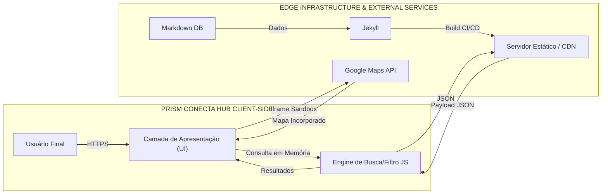
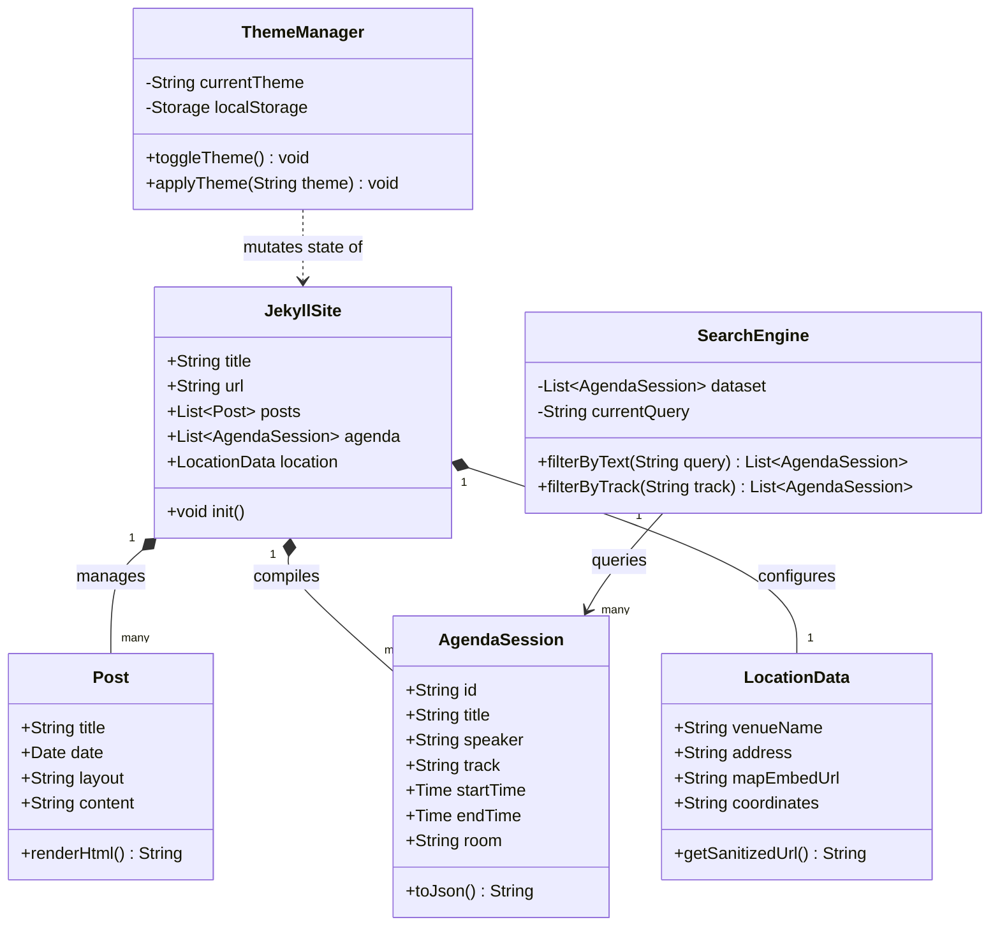
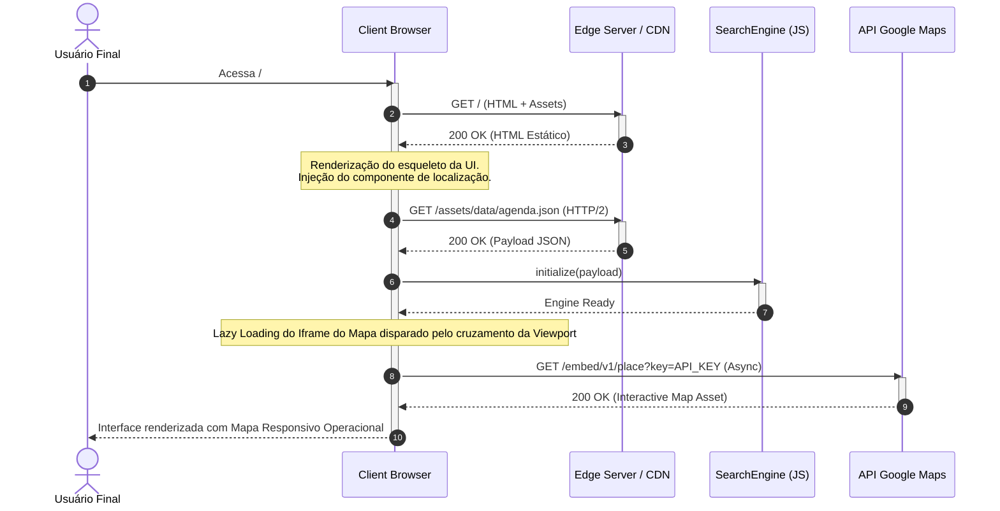
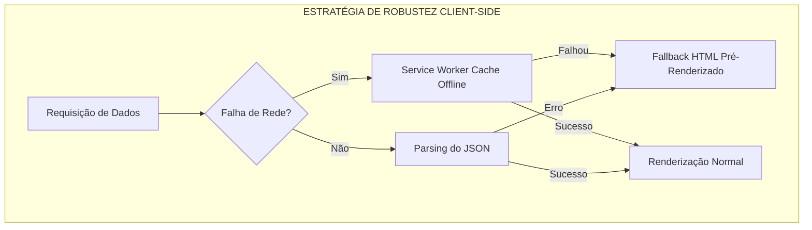

# Especificação Técnica de Engenharia (Spec) — PRISM Conecta Hub

---

## 1. Análise de Requisitos e do Domínio

### Visão Executiva

O **PRISM Conecta Hub** mitiga a dispersão de informações e a latência de comunicação em eventos tecnológicos por meio de uma arquitetura estática otimizada baseada em Jamstack (Jekyll, Ruby). O valor técnico reside na eliminação de infraestrutura de backend dinâmica complexa no lado do servidor, transferindo a computação de renderização para o tempo de compilação (*build time*). Isso resulta em um tempo de resposta de borda previsível, acoplamento estrutural mínimo e imunidade a vetores clássicos de injeção de código, garantindo resiliência mesmo sob restrições severas de conectividade móvel na região de Roraima.

### Matriz de Requisitos (FR e NFR)

| ID | Tipo | Descrição do Requisito | Critério Técnico de Aceitação (TAC) |
| --- | --- | --- | --- |
| **RF-001** | Funcional | Alternância dinâmica de tema visual (Dark/Light mode). | Mutação de estado via CSS Custom Properties injetadas por JS local; persistência do estado no `localStorage` do cliente com latência de aplicação $< 50\text{ms}$. |
| **RF-002** | Funcional | Feed de notícias dinâmico via parsing de arquivos estruturados. | Compilação determinística via Jekyll Collections a partir de arquivos Markdown estruturados no Front Matter. |
| **RF-003** | Funcional | Catálogo de Agenda com busca e filtragem multifacetada por tema e horário. | Filtragem client-side em engine JavaScript pura atuando sobre um payload JSON estático pré-renderizado; complexidade de tempo máxima de $O(N)$ onde $N$ é o número de sessões. |
| **RF-004** | Funcional | Redirecionamento e conversão para Inscrição Externa. | Links parametrizados com checagem de integridade sintática e rastreamento de clique via atributos `data-*` sanitizados. |
| **RF-005** | Funcional | Exibição de Localização com Mapa Interativo Responsivo. | Injeção de contêiner assíncrono via `<iframe>` ou API de Mapas isolada, com redimensionamento dinâmico baseado em CSS Flexbox/Grid e regras de aspect-ratio de mídia, sem quebra de viewport móvel. |
| **RNF-001** | Não-Funcional | Performance de carregamento em redes móveis restritas. | Performance Score no Google Lighthouse $\ge 90$ em emulação móvel; Time to First Byte (TTFB) $< 200\text{ms}$. |
| **RNF-002** | Não-Funcional | Reprodutibilidade e isolamento do ambiente de desenvolvimento. | Manifesto `docker-compose.yml` multi-estágio garantindo paridade estrita de versões do Ruby runtime e Gems entre as estações de trabalho e o pipeline de CI/CD. |
| **RNF-003** | Não-Funcional | Portabilidade Arquitetural. | Acoplamento eferente zero com bancos de dados relacionais ou servidores de aplicação dinâmicos; geração exclusiva de artefatos estáticos (`.html`, `.css`, `.js`, `.json`). |

### Identificação de Atores e Limites

**Atores Humanos:**
* **Usuário Final (Participante):** Consome dados da agenda, notícias, interage com os filtros de busca client-side e visualiza a rota espacial do evento.
* **Gerenciador de Conteúdo / Administrador:** Interage diretamente com o repositório Git, submetendo atualizações em Markdown.

* **Atores de Sistema (Limites Externos):**
* **Plataforma de Inscrição Externa:** Sistema terceiro destino para o qual o usuário é redirecionado para efetivar o cadastro no evento.
* **Provedor Externo de Geolocalização/Mapas:** API/Serviço externo (ex: Google Maps Embed) integrado via link embutido para renderização espacial.
* **Engine de Runtime Docker:** Abstração local para execução determinística do ambiente Jekyll de desenvolvimento.

---

## 2. Modelagem Estrutural (UML e Componentes)

### Diagrama de Classes (Componentes Estáticos de Dados)

### Decomposição de Módulos

* **Módulo Core/Static Compiler (Jekyll Engine):** Responsável pelo acoplamento aferente do sistema. Compila o estado declarativo (arquivos Markdown de posts, sessões da agenda e dados de localização estruturados em YAML/Front Matter) em ativos estáticos. Apresenta acoplamento eferente zero com o runtime de produção.
* **Módulo State/Theme Controller (JS):** Componente desacoplado de execução síncrona imediata (*head-injected*). Gerencia as mutações de propriedades customizadas do CSS no objeto `document.documentElement` para evitar *Flash of Unstyled Content* (FOUC).
* **Módulo Client-Side Search Engine (JS):** Componente funcional puramente determinístico. Consome um dicionário JSON gerado em tempo de compilação contendo o mapeamento completo da agenda. Mantém isolamento total de rede, executando operações exclusivamente em memória RAM.

---

## 3. Dinâmica e Comportamento do Sistema

### Diagrama de Sequência (Fluxo de Inicialização, Busca e Carregamento do Mapa)

### Fluxo Operacional Detalhado

#### 1. Inicialização do Tema e Tratamento de FOUC (*Happy Path*)

* **Passo 1:** O parser HTML lê a tag `<head>`. Um script inline síncrono bloqueante intercepta o fluxo.
* **Passo 2:** Verifica a chave `theme` no `window.localStorage`. Se nula, avalia `window.matchMedia('(prefers-color-scheme: dark)')`.
* **Passo 3:** Atribui o atributo `data-theme` ao elemento raiz `<html>`. O engine de renderização CSS mapeia as cores em tempo de computação de layout, mitigando oscilações visuais.

#### 2. Processamento do Contêiner de Localização e Mapa (*Happy Path*)

* **Passo 1:** Durante o build, o Jekyll processa as coordenadas contidas no arquivo `_config.yml` e injeta a string higienizada na tag `<iframe>`.
* **Passo 2:** No client-side, o navegador interpreta o atributo `loading="lazy"` e suspende a requisição de rede para a API de mapas até que o usuário role a página próximo à seção correspondente.
* **Passo 3:** O container CSS calcula as dimensões de forma responsiva aplicando a técnica de padding intrínseco ou `aspect-ratio: 16/9`, escalando perfeitamente do layout desktop ao viewport mobile (320px de largura mínima).

#### 3. Busca e Filtragem Client-Side com Payload Corrompido (*Fluxo de Exceção*)

* **Cenário:** O arquivo `agenda.json` foi gerado com sintaxe inválida durante um build que falhou no pipeline de CI/CD ou foi truncado por instabilidade de rede.
* **Algoritmo de Contingência:**
1. O bloco de captura `fetch('/assets/data/agenda.json')` falha no método `.json()` gerando uma exceção do tipo `SyntaxError`.
2. O bloco `catch` intercepta a falha e impede o travamento da thread principal do JavaScript.
3. O sistema executa um *Graceful Degradation*: esconde o input de busca, altera o estado da UI para exibir uma mensagem informativa ao usuário ("Programação temporariamente indisponível") e renderiza um fallback em HTML estático básico pré-compilado embutido na própria página.
4. Um log de erro estruturado silencioso é enviado para o coletor de telemetria se a rede estiver operacional.

---

## 4. Análise de Riscos e Robustez (Mentalidade de Chaos Engineering)

### Análise de Ponto Único de Falha (SPOF)

* **SPOF 1: CDN / Servidor de Arquivos Estáticos:** Se a infraestrutura de hospedagem (ex: GitHub Pages, Vercel ou o servidor institucional da universidade) falhar, o site fica completamente inacessível.
* *Impacto:* Catastrófico (Indisponibilidade total).

* **SPOF 2: Runtime JavaScript para a Agenda:** Se o script do motor de filtragem falhar devido a algum bug de compatibilidade em navegadores antigos, o usuário perde o acesso à busca de horários.
* *Impacto:* Alto (Perda de funcionalidade crítica de usabilidade).

* **SPOF 3: Latência/Bloqueio da API de Mapas Externa:** Se o provedor externo do mapa estiver indisponível ou se o dispositivo estiver operando sob latência severa de rede móvel (edge), a requisição externa trava ou exibe um componente vazio.
* *Impacto:* Médio (Degradação visual da seção de localização).

### Mitigação de Erros

* **Estratégia de Cache de Borda e Offline (Service Worker):** Implementação de uma estratégia de cache de rede do tipo *Stale-While-Revalidate* via Service Workers. Se a rede falhar durante o evento, o Service Worker serve localmente a última versão válida do portal e do JSON da agenda salvos no cache do dispositivo do participante, neutralizando o SPOF de rede.
* **Resiliência de Links de Inscrição Externa (Idempotência Comportamental):** Os botões de redirecionamento para o sistema de inscrição externo não dependem de estados de sessão locais ou cookies. Eles usam links HTML puros com alvos estáticos seguros (`rel="noopener noreferrer"`). Caso a plataforma externa caia, o portal injeta programaticamente um aviso dinâmico informando instabilidade no sistema parceiro, preservando a integridade da experiência do Hub.
* **Mecanismo de Degradação Suave do Mapa Responsivo (Circuit Breaker Client-Side):** Para mitigar o travamento por falha do terceiro provedor de mapas, a tag `<iframe>` é envolvida por um contêiner estruturado que renderiza, por padrão e em camada inferior, as coordenadas em formato hipertexto puro contendo endereço completo e link absoluto de fallback do tipo `geo:latitude,longitude`. Se o script do iframe falhar ao carregar ou atingir um timeout de 5 segundos via monitoramento JS interno, a injeção do elemento visual é abortada e o texto com o link de fallback geo-referenciado permanece legível e funcional ao participante.

### Segurança e Observabilidade

* **Content Security Policy (CSP):** Sendo um site estático, a política de segurança restringe conexões externas rigidamente, permitindo explicitamente os domínios de mapas homologados:
`Content-Security-Policy: default-src 'self'; script-src 'self' 'trusted-cdn.com'; style-src 'self' 'unsafe-inline'; connect-src 'self' *.googleapis.com; img-src 'self' data: *.gstatic.com; frame-src 'self' *.google.com;`
Isso anula ataques de Cross-Site Scripting (XSS) via injeção de scripts não autorizados de terceiros.
* **Observabilidade Estática (Client-Side Logging):** Monitoramento focado em Core Web Vitals (LCP, FID, CLS). Erros de runtime JavaScript e falhas de carregamento de assets são capturados globalmente via escuta ao evento `window.onerror` e armazenados em buffers locais antes de serem descarregados de forma assíncrona para um endpoint analítico externo, sem impactar a thread de execução do usuário.

---

## 5. Recomendações para Evolução Arquitetural

### Escalabilidade Computacional e de Infraestrutura

* **Escalabilidade Horizontal via Distribuição Geográfica (Edge Network):** Migrar os artefatos gerados pelo Jekyll para uma rede de distribuição de conteúdo (CDN) com suporte a roteamento Anycast. Isso garante que as requisições originadas em dispositivos móveis na região norte sejam resolvidas no ponto de presença (PoP) geograficamente mais próximo, reduzindo a latência do handshake TLS.
* **Isolamento de Compilação (CI/CD Decoupling):** Separar o ambiente de execução e build. O container Docker deve rodar de forma isolada em pipelines automatizados (como GitHub Actions). O webhook do repositório dispara o build a cada alteração de arquivo Markdown, gerando o artefato final isolado de qualquer dependência ativa em servidores locais da instituição.

### Gerenciamento de Dívidas Técnicas Potenciais

* **Substituição da Busca In-Memory Linear por Índices Invertidos:** A abordagem atual de busca client-side por varredura linear de array apresenta complexidade $O(N)$. Se o volume de sessões e atividades da agenda crescer substancialmente nas próximas edições do evento, essa busca causará travamentos perceptíveis de UI na thread principal do navegador. Recomenda-se a transição preventiva para uma biblioteca de busca por índice invertido leve empacotada em JavaScript autônomo (ex: Lunr.js ou similar) compilada estaticamente junto com os dados, otimizando o tempo de busca para complexidade sub-linear.