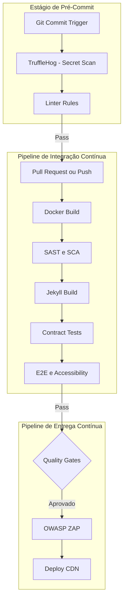

# Plano Estratégico de Engenharia da Qualidade e DevSecOps — PRISM Conecta Hub

---

## 1. Arquitetura de Testes e Estratégia de Validação

### Pirâmide de Testes Personalizada (Stack Estática/Jamstack)

A natureza arquitetural do **PRISM Conecta Hub** transfere a computação para o tempo de compilação (*build time*). Portanto, a pirâmide tradicional é adaptada para mitigar falhas de integração de dados em arquivos planos (Markdown/YAML) e falhas de runtime JavaScript em memória no navegador.

```
       /\
      /  \     E2E / Regressão Visual (~5%) - Validação de Fluxos Críticos (Inscrição)
     /----\
    /      \   Integração / Contratos (~25%) - Compilação Jekyll e Parsing de Esquemas JSON
   /--------\
  /          \ Unitários / Regras UI (~70%) - Funções de Busca JS e State Controllers
 /------------\

```

* **Testes Unitários (Camada Base - ~70%):** Validação funcional determinística isolada. Foco no algoritmo de filtragem linear/sub-linear do `SearchEngine` e nos métodos mutadores do `ThemeManager`.
* **Testes de Integração e Compilação (Camada Média - ~25%):** Validação de integridade semântica. Garante que os parsers do Jekyll Collections compilem adequadamente a folha de Front Matter do Markdown contra esquemas estritos, gerando o dicionário `agenda.json` sem anomalias estruturais.
* **Testes End-to-End (E2E) e Regressão Visual (Camada de Topo - ~5%):** Validação de comportamento no browser. Simulação de jornadas do usuário: alternância de tema, acionamento do lazy loading do iframe de localização e rastreamento de cliques de saída (*outbound links*) nos CTAs de inscrição.

### Contratos e APIs (Consumer-Driven Contract Testing)

Como o frontend consome um payload estático gerado intrinsecamente (`agenda.json`), o conceito clássico de Contract Testing entre microsserviços distribuídos é transposto para um modelo de **Isolamento de Contrato de Artefato** utilizando o **Prism** como mock generator e validação de schema JSON (JSON Schema Draft-07).

O pipeline de testes valida se o esquema estrutural do payload gerado pelo compilador Jekyll atende perfeitamente à assinatura tipada esperada pela engine do cliente JS. Se um colaborador submeter um Markdown na coleção `_agenda` sem o campo mandatório `speaker` ou com o tipo de dado `startTime` corrompido, o teste de contrato rejeita o build no estágio de pré-compilação.

### Ambientes Efêmeros com Docker

Para garantir paridade estrita em Pull Requests (PRs), o ambiente de testes é orquestrado de forma efêmera e imutável por meio do isolamento em containers. Abaixo apresenta-se o manifesto `docker-compose.test.yml`, projetado para subir o stack local de testes, executar os scripts de validação de linter/testes e encerrar os containers com código de saída explícito.

```yaml
version: '3.8'

services:
  jekyll-compiler:
    image: ruby:3.2-slim
    environment:
      - JEKYLL_ENV=production
    volumes:
      - .:/src
    working_dir: /src
    command: >
      sh -c "apt-get update && apt-get install -y build-essential &&
             bundle install &&
             bundle exec jekyll build --destination ./dist"

  test-runner:
    image: mcr.microsoft.com/playwright:v1.40.0-jammy
    depends_on:
      jekyll-compiler:
        condition: service_completed_successfully
    volumes:
      - .:/src
    working_dir: /src
    command: >
      sh -c "npm ci &&
             npx playwright test"

```

---

## 2. Engenharia da Qualidade (TDD e BDD)

### Ciclo Red-Green-Refactor no Motor de Busca (JavaScript)

A aplicação de Test-Driven Development (TDD) é mandatória na lógica de busca in-memory do `SearchEngine` para mitigar regressões de performance.

1. **RED (Falha):** Criação de uma asserção de teste que valide a filtragem por expressões regulares ignorando diacríticos (acentuação gráfica) comuns na língua portuguesa regional (ex: filtrar por "Engenharia" e capturar "engenharia"). O teste falha pois a engine ainda não trata sanitização de strings.
2. **GREEN (Sucesso):** Implementação do código mínimo que satisfaça a busca, utilizando `String.prototype.normalize("NFD")` para remover acentos.
3. **REFACTOR (Otimização):** Refatoração do laço de varredura de $O(N)$ para um modelo indexado, limpando referências nulas sem alterar o comportamento externo validado pelo teste.

### Padrões de Automação: Page Object Model (POM)

Para isolar a volatilidade dos seletores de interface (DOM) das asserções lógicas dos testes E2E, adota-se rigorosamente o padrão **Page Object Model** usando Playwright.

Exemplo de implementação do POM para validação do componente de localização e alternância de tema visual:

```javascript
// tests/page-objects/MainPage.js
class MainPage {
  constructor(page) {
    this.page = page;
    this.themeToggleBtn = page.locator('#theme-toggle');
    this.htmlRoot = page.locator('html');
    this.mapIframe = page.locator('iframe[src*="google.com/embed"]');
    this.fallbackLocationLink = page.locator('a[href^="geo:"]');
  }

  async goto() {
    await this.page.goto('/');
  }

  async toggleTheme() {
    await this.themeToggleBtn.click();
  }

  async scrollToMap() {
    await this.mapIframe.scrollIntoViewIfNeeded();
  }
}
module.exports = { MainPage };

```

```javascript
// tests/e2e/theme-location.spec.js
const { test, expect } = require('@playwright/test');
const { MainPage } = require('../page-objects/MainPage');

test.describe('PRISM Conecta Hub - UI & UX Validation', () => {
  test('Deve chavear o tema visual e persistir no localStorage', async ({ page }) => {
    const mainPage = new MainPage(page);
    await mainPage.goto();
    
    await expect(mainPage.htmlRoot).toHaveAttribute('data-theme', 'dark'); // Default target
    await mainPage.toggleTheme();
    await expect(mainPage.htmlRoot).toHaveAttribute('data-theme', 'light');
  });

  test('Deve aplicar Lazy Loading no Iframe de Localização', async ({ page }) => {
    const mainPage = new MainPage(page);
    await mainPage.goto();
    
    // Verifica resiliência do Fallback se a rede falhar
    await expect(mainPage.fallbackLocationLink).toBeVisible();
    await mainPage.scrollToMap();
    await expect(mainPage.mapIframe).toBeVisible();
  });
});

```

### Gerenciamento de Dados de Teste (TDM)

Em arquiteturas Jamstack, o banco de dados é composto por arquivos planos. A estratégia de **Test Data Management (TDM)** adota a geração de fixtures estáticas baseadas em modelos sintéticos estruturados em arquivos Markdown temporários antes da execução da suíte de testes.

* **Isolamento:** O script de testes injeta uma coleção controlada de 5 arquivos Markdown sintéticos na pasta `_agenda/` de testes.
* **Limpeza:** Ao finalizar a execução da suíte, um gancho de limpeza (`afterAll`) executa uma rotina de deleção atômica eliminando os arquivos temporários, prevenindo o vazamento de estado (*test pollution*) entre execuções do CI.

---

## 3. UX, UI e Acessibilidade (Shift-Left)

### Testes de Regressão Visual (VRT)

Mudanças sutis em folhas de estilo CSS globais podem causar quebras catastróficas de layout em dispositivos móveis restritos, comprometendo o objetivo de usabilidade em menos de 3 cliques. O pipeline integrará o motor nativo de comparação de pixels do Playwright VRT. A cada execução, capturas de tela (*snapshots*) do estado renderizado (Dark e Light Mode) em resoluções mobile padrão (360x740px) e desktop (1920x1080px) serão validadas contra imagens de referência (*baselines*) homologadas pelo designer do projeto. Qualquer desvio de layout superior a um limiar de tolerância de picheis (*mismatch tolerance* $> 0.5\%$) aborta automaticamente o merge do código.

### Acessibilidade Automatizada (Axe-Core Engine)

Em conformidade com a cultura Shift-Left, a validação de acessibilidade digital ocorre integrada aos testes funcionais automatizados através do `@axe-core/playwright`. O teste varre a árvore de acessibilidade do DOM assegurando o cumprimento estrito dos critérios de sucesso da **WCAG 2.1 Nível AA**.

```javascript
// tests/integration/accessibility.spec.js
const { test, expect } = require('@playwright/test');
const AxeBuilder = require('@axe-core/playwright').default;

test('Homologação de Acessibilidade Digital contra WCAG 2.1 AA', async ({ page }) => {
  await page.goto('/');
  
  const accessibilityReport = await new AxeBuilder({ page })
    .withTags(['wcag2a', 'wcag2aa'])
    .exclude('#ignored-third-party-widgets')
    .analyze();
    
  expect(accessibilityReport.violations).toEqual([]);
});

```

---

## 4. Estratégia de Segurança (SSDLC e OWASP)

### Modelagem de Ameaças (Threat Modeling)

Ainda que a superfície de ataque seja drasticamente reduzida devido à arquitetura Jamstack estática, existem vetores de risco específicos identificados na borda e na cadeia de suprimentos de software (*software supply chain*):

* **Ameaça 1: Poluição de Scripts de Terceiros e Bypass de CSP (XSS Indireto):** Injeção de dependências comprometidas via pacotes npm utilizados na engine JavaScript client-side.
* **Ameaça 2: Negação de Serviço na Camada de Aplicação (DoS no Browser por JSON Inflado):** Um ataque que submeta um payload `agenda.json` massivo ou malformado pode exaurir a memória RAM e travar o navegador móvel do usuário final durante o processamento linear da filtragem.
* **Ameaça 3: Sequestro de Links e Phishing de Inscrição Externa:** Manipulação maliciosa de arquivos Markdown no repositórioGit que altere o destino do CTA de inscrição para um servidor malicioso clonado.

### Análise Estática, Dinâmica e Composição de Software (ASOC)

Para gerenciar vulnerabilidades continuamente, integram-se três ferramentas automatizadas de análise de segurança:

1. **SAST (Static Application Security Testing):** Utilização do **Brakeman** focado em checar vulnerabilidades na estrutura Ruby/Jekyll do ecossistema e do **Semgrep** com regras específicas para JavaScript (proibição do uso de `innerHTML` ou `eval()` na manipulação do motor de busca, mitigando XSS client-side).
2. **SCA (Software Composition Analysis):** Execução do `npm audit` e do plugin `bundler-audit` no pipeline de build para mapear vulnerabilidades críticas conhecidas (CVEs) tanto nas Gems do Ruby quanto nos pacotes npm Node.js.
3. **DAST (Dynamic Application Security Testing):** Execução automatizada do **OWASP ZAP** em modo *API/Daemon* contra o servidor estático local temporário gerado no container Docker do CI para checar cabeçalhos HTTP ausentes e sniffing de tráfego.

### Segurança de Infraestrutura e Hardening de Contêineres

* **Detecção de Segredos (Secret Scanning):** Acoplamento do **TruffleHog** como hook de pré-commit para bloquear o commit acidental de chaves privadas de API de mapas no repositório Git.
* **Hardening das Imagens Docker:** O manifesto do ambiente de build utiliza distribuições mínimas e otimizadas (`ruby:3.2-slim`). Garante-se que o processo de execução dentro do contêiner adote o princípio do menor privilégio, rodando sob um usuário não-root criado explicitamente (`USER node` ou `USER jekylluser`), bloqueando escalabilidade de privilégios caso o ambiente de CI seja comprometido.

---

## 5. Pipeline DevSecOps e Observabilidade

### Visualização do Pipeline Contínuo de Engenharia



### Métricas de Desempenho de Engenharia (DORA Metrics)

A eficácia da automação de testes e segurança será governada por quatro indicadores de desempenho da engenharia (DORA metrics):

* **Frequência de Deploy (Deployment Frequency):** A meta é viabilizar múltiplos deploys estáticos por dia. Mudanças em Markdowns informativos devem fluir de forma automatizada e segura sem intervenção humana manual.
* **Lead Time para Mudanças (Lead Time for Changes):** O tempo total desde o commit inicial em um branch de correção de conteúdo até a disponibilização do artefato otimizado na borda (CDN) não deve exceder 7 minutos (tempo limite de execução do pipeline de CI/CD).
* **Tempo Médio para Recuperação (MTTR):** Em caso de indisponibilidade ou deploy de informação errônea na agenda, o MTTR será minimizado para $< 2\text{ minutos}$ através do disparo automatizado de um *Rollback de Ponteiro Git*, apontando instantaneamente a CDN para o hash de commit anteriormente estável.
* **Taxa de Falha de Mudanças (Change Failure Rate):** Manter o indicador abaixo de $2\%$. Qualquer quebra de regressão visual ou erro de compilação detectado em produção indica a necessidade de endurecimento das asserções e testes do pipeline.

### Observabilidade e Monitoramento de Produção

Como não há um backend tradicional gerando logs em arquivos internos do servidor, a telemetria é implementada via instrumentação client-side leve através do padrão de especificação **OpenTelemetry (OTel)** para browsers.

* **Rastreamento de Exceções:** Um listener global escuta o evento `window.onerror`. Quando uma falha de parse ou indisponibilidade de terceiro (API de mapas) ocorre, o OTel encapsula o contexto técnico do erro em um payload estruturado JSON assíncrono não-bloqueante enviado para um coletor de logs externo.
* **Monitoramento de Performance:** Rastreamento contínuo dos indicadores de experiência real do usuário (Real User Monitoring - RUM), focando em flutuações das métricas de Core Web Vitals reportadas diretamente pelos dispositivos dos participantes no local do evento.

---

## 6. Diagnóstico e Plano de Action

### Matriz de Riscos Críticos

| Vulnerabilidade/Ponto Frágil Identificado | Severidade | Impacto no Negócio / Evento | Estratégia de Resolução Proposta |
| --- | --- | --- | --- |
| **Risco 1: Quebra do Motor de Busca por Falha Sintática no JSON Estático** | **Alta** | Usuários em redes móveis ficam impossibilitados de encontrar horários de palestras em tempo real. | Implementação de Contract Testing (JSON Schema Validation) integrada rigidamente no pipeline de CI. |
| **Risco 2: Bloqueio Total por Inacessibilidade da API Externa de Mapas** | **Média** | Degradação visual e travamento do carregamento da interface em dispositivos com conexões restritas. | Acoplamento do mecanismo de Circuit Breaker com fallback HTML geo-referenciado nativo. |
| **Risco 3: Dependências Desatualizadas ou Vulneráveis no Ecossistema Jekyll/Ruby** | **Baixa** | Comprometimento potencial da estação de trabalho local do desenvolvedor ou do pipeline de CI. | Isolamento rigoroso de runtime via Docker multi-estágio e automação com dependabot/SCA. |

### Roadmap de Implementação Tática

```
[Semana 1: Crítico] ──> [Mês 1: Estrutural] ──> [Trimestre 1: Otimização]

```

#### Semana 1: Estágio Crítico (Mitigação de Riscos de Lançamento)

* [ ] Isolar os ambientes de execução local e padronizar dependências Ruby via arquivos `Gemfile.lock` e Docker.
* [ ] Desenvolver e integrar os testes unitários do motor de filtragem de dados JavaScript.
* [ ] Implementar o validador de esquema JSON estrito no build automatizado do Jekyll.
* [ ] Adicionar a checagem básica de segredos via TruffleHog no pipeline para mitigar vazamentos de chaves de mapas.

#### Mês 1: Estágio Estrutural (Garantia de Ciclo de Vida Seguro)

* [ ] Implementar a suíte completa de testes E2E com Playwright cobrindo os cenários críticos de UX.
* [ ] Configurar a análise SAST com Semgrep e os testes automatizados de acessibilidade digital (Axe-Core).
* [ ] Desenvolver o Service Worker para garantir suporte offline resiliente dos dados da agenda durante o evento.

#### Trimestre 1: Estágio de Otimização e Sustentabilidade

* [ ] Lançar testes automatizados de regressão visual para garantir conformidade de layout responsivo multiplataforma.
* [ ] Otimizar o motor de busca substituindo a lógica in-memory $O(N)$ por um algoritmo de indexação invertida.
* [ ] Configurar painéis analíticos automatizados para consolidação das métricas DORA coletadas no ciclo de engenharia do repositório Git.

---

## 7. Justificativa Econômica e Retorno sobre o Investimento (ROI)

A automação radical das etapas de validação técnica, acessibilidade e análise de vulnerabilidades de segurança proposta neste plano se traduz em vantagens financeiras e operacionais diretas para a coordenação do projeto:

$$\text{ROI} = \frac{\text{Custo Consertado em Produção (Manual)} - \text{Custo de Prevenção no CI (Automatizado)}}{\text{Custo de Prevenção no CI (Automatizado)}}$$

* **Redução Drástica do Custo do Erro (Shift-Left Coeficiente):** De acordo com métricas consagradas de engenharia de software (IBM System Sciences Institute), o custo para sanar um defeito de software detectado em ambiente de produção é até **100 vezes maior** do que se o mesmo erro fosse identificado durante a fase inicial de design ou build local. Corrigir um erro sintático na programação da agenda minutos antes da abertura oficial do evento gera caos de comunicação e consome dezenas de horas-homem sob estresse severo; identificar o mesmo bug no pipeline de testes do GitHub Actions custa zero minutos de retrabalho manual.
* **Eliminação do Esforço Humano de Regressão Repetitiva:** Testar manualmente o comportamento do portal em diferentes viewports móveis, verificar contrastes de cores AA no modo escuro/claro e checar se todos os links de notícias funcionam consome cerca de 4 horas de trabalho especializado a cada alteração de conteúdo. Com a esteira DevSecOps estabelecida, esse ciclo completo de validação roda em **menos de 3 minutos**, liberando os engenheiros de software para focarem exclusivamente no desenvolvimento de novas funcionalidades de inovação, maximizando a eficiência produtiva da equipe.